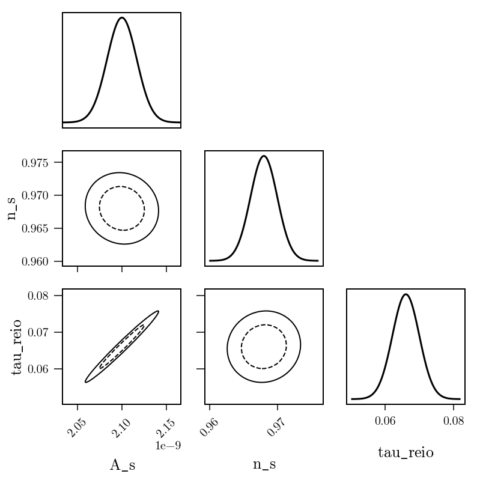

# fishchips

*fishchips* is a simple package for forecasting parameter constraints with Fisher information matrix methods for CMB and LSS experiments. I wrote this mostly to reduce friction for my future self, since I'm sure I will someday want to make some more Fisher forecasts, and I will definitely forget how.

There are a lot of other Fisher codes out there, and the basic idea is pretty simple. What makes *fishchips* so delicious?

1. **Easily add new ingredients**. Unlike other areas of software development, every user of research code wants to incorporate something new into the dish. *fishchips* was designed so that new physics and observables are straightforward to implement.
2. **You cook it yourself**. *fishchips* is more of a kit containing some common ingredients for preparing Fisher matrices, and every step is exposed. The intended workflow involves starting with a copy of the example recipes in the included Jupyter notebooks, and making changes. It isn't boilerplate, if you constantly need to turn the knobs on the boiler!
3. **No configuration files, just Python**. *fishchips* is intended for interactive work. Since it's all Python, moving it to the cluster is a matter of pasting your Jupyter cells into a Python script.

The code for *fishchips* was originally written for [arxiv:1806.10165](https://arxiv.org/abs/1806.10165), and the specifications for the included CMB experiment forecasts are in the paper's Table 1.

## Requirements
* The usual scientific Python stack (numpy, scipy, matplotlib).
* A Boltzmann code with a Python wrapper. The example `Experiment` objects are designed for use with [CLASS](https://github.com/lesgourg/class_public). However, forecasts can easily be made with pyCAMB, see the example notebook.

## Basic Example

The basic workflow using CLASS:
1. Create an `Observables` object, and describe the parameters, fiducial values, and parameter values for stepping away from the fiducial to estimate derivatives.
2. Call `Observables.compute_cosmo` with appropriate inputs for the CLASS wrapper, for each cosmology evaluation required for the derivatives, and at the fiducial values.
3. Create an `Experiment` object and pass the `Observables` object to the `Experiment.get_fisher()` function, get a Fisher matrix back!

In this example, we'll make some forecasts for the Planck TT/TE/EE constraints on three cosmological parameters: the amplitude `A_s`, spectral index `n_s`, and optical depth to reionization `tau_reio`, holding other parameters fixed.


```python
from fishchips.experiments import CMB_Primary
from fishchips.cosmo import Observables
import fishchips.util

from classy import Class  # CLASS python wrapper
import numpy as np

# create an Observables object to store information for derivatives
obs = Observables(
    parameters=['A_s', 'n_s', 'tau_reio'],
    fiducial=[2.1e-9, 0.968, 0.066],
    left=[2.0e-9, 0.948, 0.056],
    right=[2.2e-9, 0.988, 0.076])

# generate a template CLASS python wrapper configuration
classy_template = {'output': 'tCl pCl lCl',
                   'l_max_scalars': 2500,
                   'lensing': 'yes'}
# add in the fiducial values too
classy_template.update(dict(zip(obs.parameters, obs.fiducial)))

# generate the fiducial cosmology
obs.compute_cosmo(key='CLASS_fiducial', classy_dict=classy_template)

# generate an observables dictionary, looping over parameters
for par, par_left, par_right in zip(obs.parameters, obs.left, obs.right):
    classy_left = classy_template.copy()
    classy_left[par] = par_left
    classy_right = classy_template.copy()
    classy_right[par] = par_right
    # pass the dictionaries full of configurations to get computed
    obs.compute_cosmo(key=par + '_CLASS_left', classy_dict=classy_left)
    obs.compute_cosmo(key=par + '_CLASS_right', classy_dict=classy_right)

# compute the Fisher matrix with a Planck-like experiment
example_Planck = fishchips.experiments.CMB_Primary(
    theta_fwhm=[7.], sigma_T=[33.], sigma_P=[56.],
    f_sky=0.65, l_min=2, l_max=2500)
fisher = example_Planck.get_fisher(obs)

# use the plotting utility to get some dope ellipses for 1,2 sigma.
cov = np.linalg.inv(fisher)
fishchips.util.plot_triangle(obs, cov);
```


